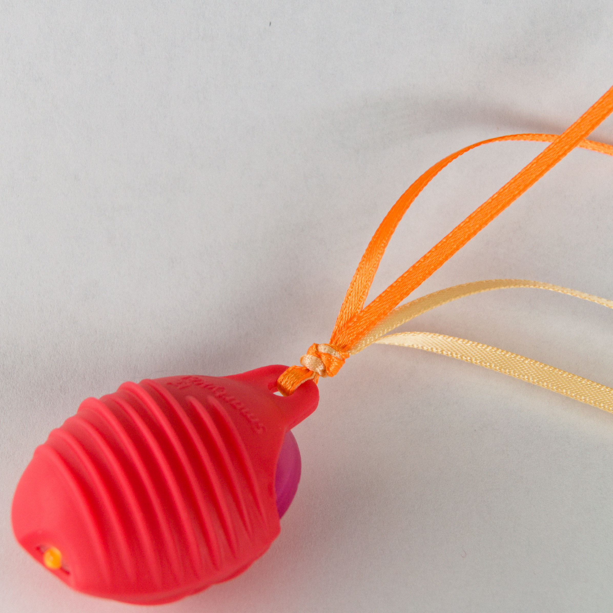
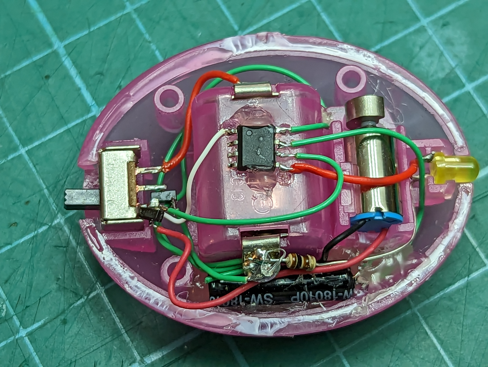

# Smart SmartyKat Toy
## Modifying the SmartyKat Crazy Cruiser to be smarter about battery consumption

The Crazy Cruiser cat toy by SmartyKat is not so smart. The toy is the cat equivalent of a simple bristle bot. It consists of a power switch, LED, and vibration motor all powered by two LR44 coin cells. To activate the toy for cat play time a human is required to turn the toy on. During playtime it runs at a constant vibration speed and the light doesn't even blink! Not that smart. This also means that when kitty gets tired of playing (if a kitten can get tired please let me know) the toy will continue to run and drain the batteries. I aim to fix that by making the toy smarter.

Simple and minimal parts will be used to smarten up this toy, after all it is still a low cost cat toy. This will be accomplished by adding a vibration switch and a microcontroller. The vibe switch will be used to wake up the uC from deep low power sleep in which the uC will start the vibration motor and LED. The toy will then remain active for a set amount of time then turn off to be activated later.

For more info see: https://samueldperry.com/2023/03/04/smart-smartykat-toy/